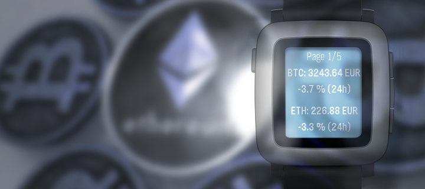
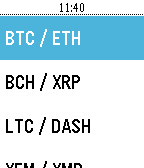
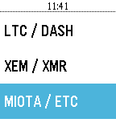
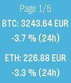
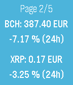

# CoinMarket for Pebble

Check easily the value and evolution of the top 10 cryptocurrency from coinmarketcap website.
 
Feel free to donate for dev :
- `BTC` : 154JhrS85atM8Wp9f71TLgXyQFazRCNhPw
- `ETH` : 0x353Ae57AeC532d5b511f405eac62277E8c21B3F5
- `DASH` : Xvb2MgnH8fGcDBuU6SUmwYtTSpcgVyuDMT

## User interface

### Menu

Once your launch the app you go on a menu : 

On this menu you can access of the data of the top 10 currency by simply selecting the one you want.

### Example of cryptopage 

You can see that on each page you got the data from 2 currencies.
You can see the fiat value of the crypto and also the evolution in the 24 last hours.

### Settings

On the phone you can change via the settings of the app (in the Peblle App) the value of the fiat you want for the conversion.
By default it will be in EUR.

## Todo

- Add Time Round Support
- Correct bug to exit the app (for the moment long press on back to quit directly !)